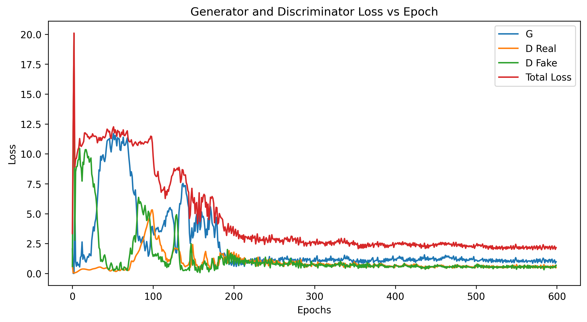
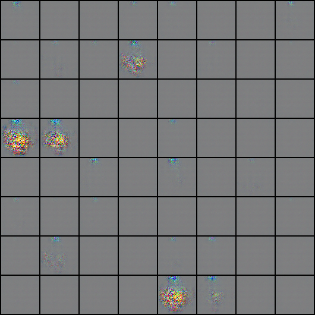

# `uncanny-emoji`

We're going to generate some uncomfortable emoji that shouldn't exist.

Unless it works, then they're just new emoji.

## Approach

I'm going to create a DCGAN, using [this Kaggle dataset](https://www.kaggle.com/datasets/subinium/emojiimage-dataset) as raw data.

I'll filter out only the faces, because I think it could be hard to do with flags and all that mixed in.

## Hyperparams

I ended up manually tuning hyperparameters for hours.

The big ones ended up being:

* Initial learning rate
* Gradient clipping factor
* Learning rate decay patience and factor
* Input dimensions
* Feature map size for generator

I could have run an automated search, but I ended up manually looking at the faces to how they paired up.

In hindsight, using my `fixed_noise` against the discriminator may have saved me time there.

## Results

Well. We have some very grainy emojis, and nothing extremely compelling.

### Loss vs Epoch (Final Model)

### Weight Distributions

At the beginning I started monitoring weight distributions.
I thought maybe they were collapsing to one value, because I was getting plain square outputs, like this:

That didn't seem to be the case, however.

#### Generator

#### Discriminator

### The Emojis

This is what progress looked like:

#### Epoch 5

#### Epoch 100

#### Epoch 400

Note that most are smilies.

#### Epoch 600 (Final)

Here we see a little more variety emerging.
I never solved the squares that are staticy-blue.

